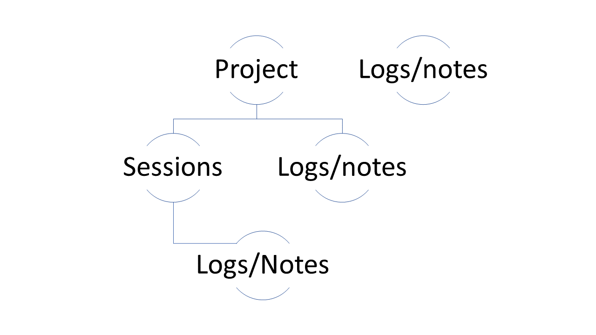
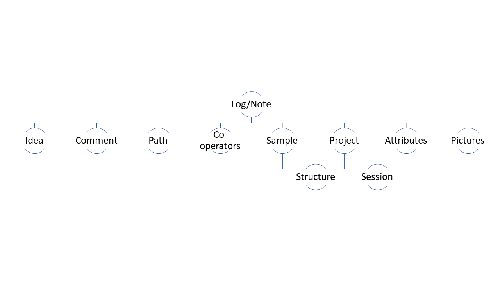

# LABhub

LABhub is an online lab notebook for organizing measurements, notes, analyses, projects, sessions, samples, setups, structures, drawers, images, attributes, remarks, and collaborators.

### Check the live demo [here](https://labhub-demo.onrender.com/) 
Email: demo@labhub.example
Password: DemoLab123!

## Documentation

- [Deployment guide](docs/deployment.md): install, configure, initialize, run, and deploy LABhub.
- [Render demo guide](docs/render-demo.md): publish a temporary online demo on Render.
- [User guide](docs/user-guide.md): core concepts and daily workflows.
- [Developer guide](docs/developer-guide.md): project layout, routes, config, compatibility notes.
- [Operations checklist](docs/operations-checklist.md): smoke tests, backup/restore, security checks.
- [Security notes](docs/security.md): secrets, data, registration, uploads, and external services.

## Quick Start

```powershell
python -m venv .venv
.\.venv\Scripts\Activate.ps1
python -m pip install --upgrade pip
pip install -r requirements.txt
copy .env.example .env
python scripts/init_db.py
set FLASK_APP=runserver.py
set FLASK_ENV=development
flask run --port=5000 --host=127.0.0.1
```

Open `http://127.0.0.1:5000`, register a user, and start with a project, session, setup, and sample.

## Configuration

LABhub reads deploy-time configuration from environment variables:

- `LABHUB_SECRET_KEY`: required for real deployments.
- `LABHUB_DATABASE_URI`: SQLAlchemy database URL, defaulting to local SQLite.
- `LABHUB_LOG_FILE`: optional app log path.
- `LABHUB_SEED_DEMO_DATA`: set to `true` to create the public demo account and sample records.
- `LABHUB_AUTO_LOGIN_DEMO`: set to `true` only for a public demo to sign visitors into that account automatically.

Do not commit real `.env` files or production databases.

## Core Data Model

**Logs/notes** can be grouped into **projects** or created without a project. A project should follow a scientific goal, instrument campaign, sample series, or other coherent lab activity.

Projects can contain **sessions**. Sessions group measurements that belong to the same campaign or short-term objective. Logs can also exist directly under a project, but session-based organization is recommended.



## Log Structure

A log records the measurement idea, comments, data path, setup, sample, optional structure, attributes, cooperators, and images.

Each setup can define reusable attributes, such as temperature, pressure, voltage, sample position, instrument mode, or any other repeated measurement parameter. Images can be added to logs and given titles.


